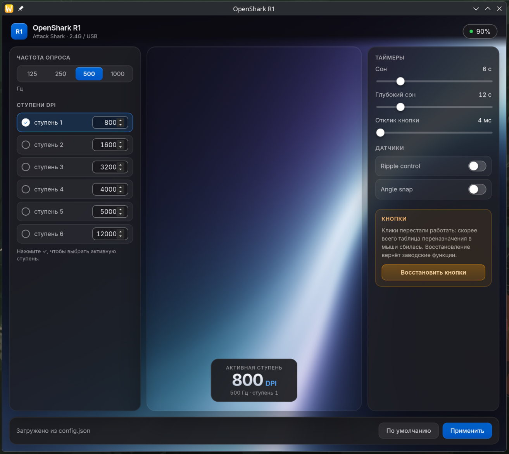

# OpenShark-R1

Controlador y utilidad de bandeja para el ratón **Attack Shark R1** en Linux.

[](LICENSE)


[English](README.md) | [Русский](README.ru.md) | [中文](README.zh.md) | **Español** | [Deutsch](README.de.md) | [Français](README.fr.md)

En la bandeja hay dos iconos: el icono del ratón y el nivel de batería
(actualizado una vez por minuto). La ventana de ajustes se abre al inicio;
al cerrarla se oculta en la bandeja, y desde allí el elemento
**Ajustes...** la vuelve a abrir.

<details>
<summary><b>Captura de pantalla</b></summary>



</details>

## Características

- Nivel de batería en la bandeja (receptor 2.4G), indicación por color
- Ventana de ajustes: frecuencia de sondeo, 6 niveles de DPI y el nivel
  activo, temporizadores de suspensión, respuesta del clic,
  ripple control / angle snap
- **Restauración de botones**: devuelve la tabla de reasignación de fábrica
  (arregla "los clics no funcionan" cuando los botones apuntan a nada)
- Los ajustes se guardan en `~/.config/openshark-r1/config.json`
- Funciona como usuario normal (mediante una regla udev)
- Backend en Rust sobre libusb (`rusb`), GUI en Tauri 2 + Svelte

## Instalación

Compilar los paquetes desde el código fuente (las dependencias están en
[Desarrollo](#desarrollo)):

```sh
pnpm install
pnpm tauri build
```

Los artefactos quedan en `target/release/bundle/`: deb, rpm, AppImage.

Instalar la regla udev una vez como root, de lo contrario el ratón solo es
accesible para root:

```sh
sudo cp udev/99-attack-shark-r1.rules /etc/udev/rules.d/
sudo udevadm control --reload-rules
sudo udevadm trigger --action=change --subsystem-match=usb
```

## Desarrollo

Dependencias (Arch/CachyOS):

```sh
sudo pacman -S --needed webkit2gtk-4.1 libayatana-appindicator librsvg \
    gtk3 pkgconf base-devel libusb rustup
```

La regla udev se instala una vez, ver [Instalación](#instalación).

Ejecutar en modo desarrollo:

```sh
pnpm install
pnpm tauri dev
```

Compilación de la versión estable:

```sh
pnpm tauri build
```

### AppImage (Arch/CachyOS)

La caché que Tauri descarga para AppImage falla en sistemas recientes: el
linuxdeploy antiguo muere con su `strip` sobre `.relr.dyn`, y el plugin gtk
fuerza `GDK_BACKEND=x11`, lo que deja la ventana en blanco con NVIDIA + Wayland.
Preparar la caché una vez:

```sh
sudo pacman -S --needed patchelf
pnpm tauri build || true   # rellena la caché; el strip puede fallar, es normal
bash scripts/appimage-fix.sh
pnpm tauri build
```

Tras limpiar `~/.cache/tauri`, repetir los pasos con `appimage-fix.sh`.

### Pruebas

Pruebas del controlador (las de hardware están desactivadas por defecto):

```sh
cargo test                # solo pruebas unitarias, no toca el ratón
cargo test -- --ignored   # + pruebas con el dispositivo real
```

Batería desde la consola:

```sh
cargo run -p openshark-driver --example battery
```

Restaurar los botones a las funciones de fábrica desde la consola:

```sh
cargo run -p openshark-driver --example buttons
```

## Estructura del proyecto

| Ruta                            | Propósito                                             |
| ------------------------------- | ----------------------------------------------------- |
| `crates/openshark-driver`       | controlador USB de bajo nivel (libusb), sin GUI       |
| `src-tauri`                     | backend Tauri: bandeja, comandos, sondeo de batería   |
| `src/` + `static/`              | GUI de la ventana de ajustes en SvelteKit             |
| `udev/99-attack-shark-r1.rules` | permisos del dispositivo para un usuario normal       |

## Protocolo

Dispositivo: VID `0x1d57`, PID `0xfa60` (2.4G) / `0xfa61` (cable), interface 2.

- Batería: interrupt-IN EP `0x83`, byte `4` del informe × 10 = porcentaje
- Configuración (DPI, frecuencia de sondeo, temporizadores): control transfer
  `SET_REPORT` (`0x21/0x09`, wValue `0x304`–`0x306`); el ACK llega por el
  mismo EP `0x83` con `buf[2] == 0x50`
- Tabla de botones: informe de características `0x08`, 59 bytes:
  `08 3b 01` + 18 huecos de 3 bytes + suma de comprobación
  (`suma de bytes[2..58] - 1` en el último byte)

La implementación del protocolo en Odin sirvió de base:
[xb-bx/attack-shark-r1-driver](https://github.com/xb-bx/attack-shark-r1-driver).
El formato de la tabla de botones proviene de la familia de protocolos
Attack Shark (informe `0x08`).

> **Importante:** el ratón debe estar despierto (sacúdelo), de lo contrario los
> informes no se ACKean y parece que "el ratón no responde".

## Notas

- **NVIDIA + Wayland:** WebKitGTK falla con `Error 71 (Protocol error)` al
  mostrar la ventana. `src-tauri/src/main.rs` fija
  `__NV_DISABLE_EXPLICIT_SYNC=1` automáticamente si detecta el driver NVIDIA,
  no hay que configurar nada a mano.
- La ventana es más alta que el área visible (unos 1100px de contenido): el
  botón Aplicar y la barra de estado quedan fijos abajo, el resto hace scroll.
- No ejecutes las pruebas con hardware real (`--ignored`) mientras juegas:
  `apply_config` reescribe los ajustes del ratón.

## Estado

- [x] Lectura de batería, indicador en la bandeja
- [x] Ventana de ajustes (DPI, frecuencia de sondeo, temporizadores), guardada en JSON
- [x] Restauración de la tabla de botones de fábrica

**Licencia:** [GPL-3.0](LICENSE).
